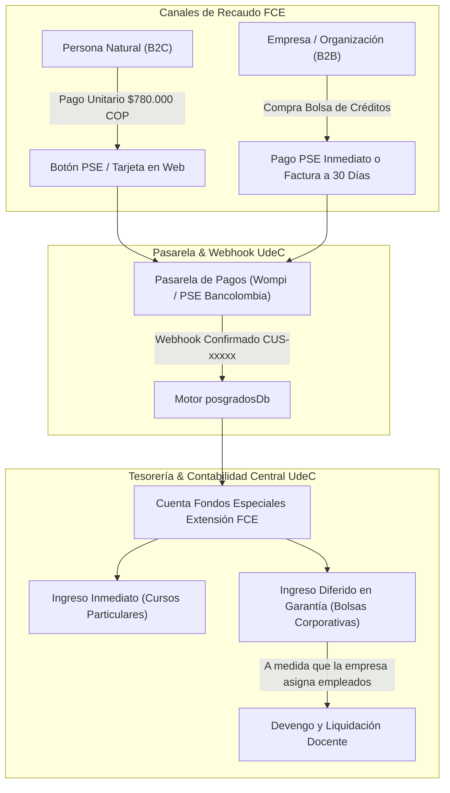

# PROPUESTA INSTITUCIONAL Y TÉCNICA
## Modernización de la Oferta de Educación Continua y Modelo Corporativo B2B
### Facultad de Ciencias Económicas — Universidad de Cartagena

**Para:**  
- Decanatura de la Facultad de Ciencias Económicas  
- Dirección de Posgrados y Educación Continua  
- Dirección Financiera y Tesorería Central UdeC  
- Centro de Tecnologías de la Información y las Comunicaciones (CTIC)  

**Fecha:** Septiembre de 2026  
**Estado:** Plataforma en Fase de Validación Operativa y Técnica  

---

### 1. RESUMEN EJECUTIVO

La presente propuesta formaliza la implementación de la **Plataforma Digital de Educación Continua y Formación Corporativa** de la Facultad de Ciencias Económicas (FCE) de la Universidad de Cartagena. 

Este proyecto responde a una transformación estratégica de la oferta académica: **complementar y dinamizar los programas formales de maestría y doctorado mediante la comercialización ágil de 124 cursos cortos y módulos ejecutivos independientes de posgrado**, dirigidos tanto a profesionales independientes (B2C) como a empresas y organizaciones del sector productivo de la región Caribe y Colombia (B2B).

El sistema cuenta con:
1. **Un Catálogo Digital Interactivo** con los 124 cursos organizados por facultades y áreas estratégicas (Finanzas, Auditoría, Gestión Pública, Economía de la Salud, Comercio Internacional, Mercadeo y Gerencia).
2. **Pasarela de Recaudo Automatizada (PSE / Wompi)** que liquida inscripciones individuales y activa cursos en tiempo real sin trámites presenciales.
3. **Módulo B2B de Bolsa de Créditos Corporativos**, permitiendo a las empresas comprar paquetes de capacitación para sus colaboradores, asignar cursos de manera autónoma y monitorear el progreso y la titulación en un panel de control con auditoría en vivo.
4. **Módulo Puente con el Sistema SMA**, garantizando la compatibilidad con el sistema histórico de la universidad sin requerir modificaciones complejas a su infraestructura tecnológica actual.

---

### 2. PROBLEMÁTICA Y JUSTIFICACIÓN ESTRATÉGICA

#### 2.1. El Diagnóstico Actual
- **Barreras de Entrada a Posgrados Tradicionales:** Las maestrías y especializaciones tradicionales exigen un compromiso de 2 a 4 semestres y costos de matrícula de entre $8.000.000 y $16.000.000 COP, lo que desincentiva a profesionales en ejercicio que buscan actualización puntual y rápida.
- **Demanda Insatisfecha del Tejido Empresarial:** Empresas de la zona industrial de Mamonal, el sector hospitalario, logístico y bancario de Cartagena requieren capacitar a sus equipos en competencias específicas (ej. NIIF, Decisiones Financieras, Auditoría Médica) sin matricularlos en programas completos de 2 años.
- **Trámites Manuales y Fricción en el Recaudo:** Tradicionalmente, la inscripción a educación continua requería solicitar volante de pago, consignar en banco y radicar el recibo físico en secretaría, generando altas tasas de deserción en la intención de compra.

#### 2.2. La Solución Desarrollada
Transformar cada asignatura o módulo clave de posgrado en un **curso de corta estancia (32 a 48 horas académicas, equivalentes a 2 créditos formativos)** con certificación universitaria oficial, habilitando canales de compra inmediata en línea y esquemas de volumen corporativo.

---

### 3. MARCO JURÍDICO Y ACADÉMICO: EDUCACIÓN CONTINUA VS. SISTEMA SMA

Una inquietud fundamental para las directivas universitarias es el alcance legal del diploma y la interacción con el **SMA (Sistema de Matrícula Académica)**. A continuación se desglosa el sustento legal y operativo:

#### 3.1. Normativa Nacional Aplicable
De conformidad con el **Decreto 1075 de 2015 (Único Reglamentario del Sector Educación), Artículo 2.6.6.8**, los cursos cortos, seminarios, diplomados y talleres ofrecidos por las Instituciones de Educación Superior corresponden a la modalidad de **Educación Informal / Educación Continua**:

| Dimensión | Programa Formal de Maestría / Doctorado | Cursos Cortos y Módulos Ejecutivos (Nuestra Plataforma) |
| :--- | :--- | :--- |
| **Marco Legal** | Ley 30 de 1992, Decreto 1330 de 2019 | Decreto 1075 de 2015, Art. 2.6.6.8 |
| **Requisito MEN** | Registro Calificado obligatorio ante CONACES y código SNIES | **No requiere Registro Calificado ni código SNIES** |
| **Documento Emitido** | Título y Grado Académico ("Magíster en...") | **Certificado Oficial de Aprobación y Asistencia** emitido por la FCE - UdeC |
| **Obligatoriedad SMA** | Matrícula académica obligatoria previa para reporte al SNIES | **No requiere matrícula previa en SMA para su comercialización y cursada** |
| **Tiempo de Salida al Mercado** | 12 a 24 meses de trámite ministerial | **Inmediata (100% bajo autonomía universitaria de la FCE)** |

#### 3.2. ¿Cómo se articula esto con el SMA?
El SMA es una plataforma diseñada para el registro académico formal de pregrados y posgrados con fines de expedición de actas de grado y diplomas de ley. 

Para los cursos cortos:
1. **Autonomía Operativa de la Plataforma Web:** La nueva plataforma gestiona de forma autónoma e independiente el catálogo, el recaudo electrónico, la activación del estudiante y el acceso al aula virtual.
2. **Homologación hacia el SMA (Ruta Académica Abierta):** Si un profesional aprueba 3 o 4 módulos cortos y posteriormente decide matricularse formalmente en la Maestría oficial, el Consejo de Facultad emite un Acuerdo de Homologación de Créditos. En ese momento, los datos del estudiante y sus notas son cargados al SMA mediante el **Módulo Puente (`/admin/sma-bridge`)** desarrollado en la plataforma, sin duplicidad de digitación manual.

---

### 4. COMPONENTES YA IMPLEMENTADOS Y 100% FUNCIONALES

La plataforma no es un concepto teórico; ya se encuentra desarrollada y validada técnicamente en el entorno de la Facultad:

| Componente | Ruta en la Plataforma | Estado | Funcionalidad Clave |
| :--- | :--- | :--- | :--- |
| **Catálogo General de 124 Cursos** | `/` (Portada) | Operativo | Filtros por área (Finanzas, Auditoría, Salud, Mercadeo), búsqueda en tiempo real, desglose de créditos y precios. |
| **Detalle de Asignatura (Estilo UdeA)** | `/programas/[id]` | Operativo | Ficha técnica en 4 pestañas: *Presentación & Perfil*, *Temario & Estructura*, *Docente & Metodología*, y *Certificación Oficial con QR*. |
| **Motor de Base de Datos Transaccional** | `src/lib/db/posgradosDb.ts` | Operativo | Esquema ACID que persiste empresas, saldos de créditos, inscripciones de alumnos y transacciones financieras. |
| **Pasarela de Pagos & Webhook Automatizado** | `/api/pagos/checkout` y `/api/pagos/webhook` | Operativo | Generación de referencias únicas (`REF-UDEC-...`), simulación de confirmación bancaria (`CUS-xxxxxx`) y activación automática en menos de 2 segundos. |
| **Simulador Interactivo de Pasarela PSE** | `/checkout/simulador` | Operativo | Pantalla de validación bancaria para personas naturales y personas jurídicas, conectada al Webhook en vivo. |
| **Portal Corporativo de Empresas B2B** | `/empresas` | Operativo | Panel de autogestión para directores de talento humano: simulación de ahorro, asignación de cursos a empleados con descuento de bolsa y vista previa del certificado. |
| **Puente Interoperable SMA** | `/admin/sma-bridge` | Operativo | Exportación por lotes en formato CSV/Excel estructurado con códigos oficiales de asignaturas para migración a SMA o nómina académica. |

---

### 5. MODELO FINANCIERO Y COORDINACIÓN CON TESORERÍA CENTRAL

Para formalizar la operación con la **Dirección Financiera y Tesorería** de la Universidad de Cartagena, se establecen dos canales de recaudo claramente diferenciados:

#### 5.1. Canal 1: Persona Natural (B2C)
- **Tarifa Oficial:** COP $780.000 por curso corto (32h / 2 créditos).
- **Mecanismo:** El estudiante selecciona el curso, diligencia sus datos y realiza el pago vía PSE.
- **Tratamiento Contable:** El recurso entra directamente a la subcuenta de Fondos Especiales de la FCE como ingreso corriente de extensión. La pasarela transfiere los fondos de manera consolidada a la cuenta maestra de la Universidad.

#### 5.2. Canal 2: Empresas / B2B (Bolsas de Crédito Formativo)
- **Concepto:** Las empresas adquieren una bolsa de créditos con descuento por volumen, la cual pueden redimir a lo largo del año calendario en cualquiera de los 124 cursos del catálogo:
  - **Pack Starter (30 Créditos = 15 Cursos):** $8.400.000 COP *(Ahorro del 15%)*
  - **Pack Growth (80 Créditos = 40 Cursos):** $20.160.000 COP *(Ahorro del 25%)*
  - **Pack Enterprise (200 Créditos = 100 Cursos):** $45.500.000 COP *(Ahorro del 35%)*
- **Modalidades de Pago Empresarial:**
  1. *Pago Electrónico Inmediato (PSE Jurídico):* La empresa paga directamente y la bolsa se carga de inmediato en el portal.
  2. *Orden de Compra / Facturación Electrónica DIAN:* Para grandes empresas del sector industrial o salud con políticas de pago a 30 o 60 días, Tesorería emite la factura electrónica correspondiente. Una vez radicada la orden de compra aprobada, el administrador de posgrados activa la bolsa en el portal mediante un código de convenio institucional.
- **Conciliación de Ingresos Diferidos:** La empresa abona la totalidad de la bolsa. Contablemente, Tesorería registra el monto como pasivo/ingreso diferido. Conforme la empresa va asignando colaboradores en el portal `/empresas`, la plataforma emite un reporte mensual de ejecución desagregado para que Tesorería reconozca el ingreso devengado por curso y liquide los honorarios a los docentes correspondientes.

---

### 6. PLAN DE TRABAJO Y MESAS TÉCNICAS CON DEPENDENCIAS UDEC

Para llevar la plataforma a producción institucional plena, se proyectan las siguientes sesiones de trabajo:

| Dependencia | Temas a Tratar en Mesa Técnica | Entregable Concreto |
| :--- | :--- | :--- |
| **Dirección Financiera / Tesorería** | 1. Integración de llaves API oficiales de Wompi/Bancolombia o PSE institucional. 2. Definición del centro de costos y código contable para la FCE. 3. Procedimiento para emisión de facturas electrónicas a empresas B2B. | Configuración de credenciales de pasarela en `.env.production` y tabla de equivalencias contables. |
| **Oficina Asesora Jurídica** | 1. Aprobación del texto de Términos y Condiciones de Educación Continua. 2. Validación de la cláusula de tratamiento de datos personales (Ley 1581 de 2012 / Habeas Data). 3. Formato marco de convenio de bolsa de créditos corporativos. | Adenda legal y política de privacidad incorporada en el checkout web. |
| **Centro de Cómputo (CTIC)** | 1. Asignación de subdominio institucional (ej. `posgrados.cienciaseconomicas.unicartagena.edu.co` o `educacioncontinua.unicartagena.edu.co`). 2. Despliegue en servidores institucionales o en infraestructura cloud (Vercel / Docker UdeC). 3. Protocolo de exportación periódica hacia la base de datos de SMA. | DNS configurado con certificado SSL institucional activo. |
| **Comité de Posgrados y Currículo FCE** | 1. Aprobación del calendario de cohortes de los 124 cursos para el periodo 2026-2027. 2. Asignación de carga académica y tarifas de honorarios docentes por hora. 3. Validación de firmas digitales para los certificados con código QR. | Resolución de Facultad autorizando la oferta y el modelo de créditos. |

---

### 7. CONCLUSIÓN Y RECOMENDACIÓN

La plataforma desarrollada sitúa a la Facultad de Ciencias Económicas a la vanguardia de la educación ejecutiva en Colombia, adoptando los estándares de experiencia de usuario de las mejores universidades del país (como la Universidad de Antioquia) e incorporando un modelo de negocio B2B pionero en la región Caribe.

Se recomienda a la Decanatura y al Comité de Posgrados **aprobar la fase de socialización institucional y convocar la mesa técnica con Tesorería y CTIC** para proceder con la asignación de las credenciales de recaudo oficiales y el lanzamiento público del portal.
